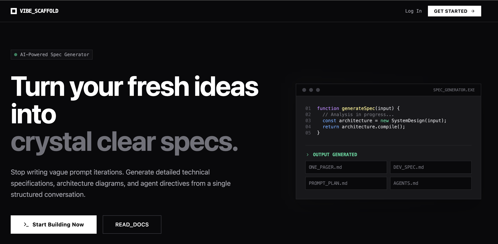
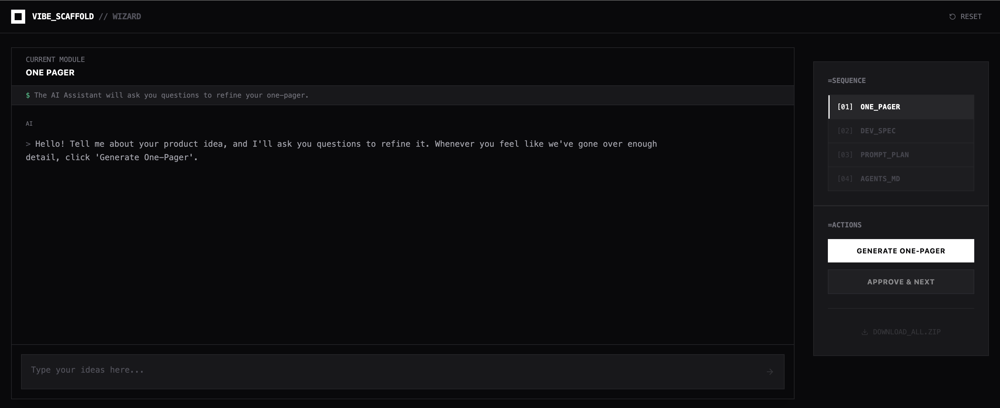

# Vibe Scaffold

[](https://vibescaffold.dev/)
[](https://github.com/benjaminshoemaker/vibecode_spec_generator)

Live at **[vibescaffold.dev](https://vibescaffold.dev/)**.

A Next.js application with a multi-step wizard interface that uses AI-powered chat to gather requirements and generate comprehensive technical specification documents.

Stop getting "close but not quite right" results from AI coding tools. Vibe Scaffold gives you a structured, step-by-step process to capture your vision and generate documentation that AI agents understand and can execute on iteratively. The app helps you refine your idea, turn it into full technical architecture, and create a step-by-step development plan. 

## Quick Start

```bash
npm install
cp .env.example .env.local
# add OPENAI_API_KEY=sk-... (and optionally NEXT_PUBLIC_GA_ID for analytics)
npm run dev
```

Then open [http://localhost:3000](http://localhost:3000) and click **Start Building Now** to launch the wizard.

## Screenshots




## Features

- **4-Step Sequential Workflow**: Each step builds on the previous with context awareness
  - **Step 1 - One Pager**: Product vision, target audience, MVP requirements
  - **Step 2 - Dev Spec**: Technical architecture, API design, data models, implementation details
  - **Step 3 - Prompt Plan**: Staged development plan with LLM-ready prompts and checklists
  - **Step 4 - AGENTS.md**: Automated agent guidance and workflow documentation

- **AI-Powered Chat**: Interactive conversations with OpenAI models via the "Vibe Scaffold Assistant"
- **Context-Aware Generation**: Later steps receive previous documents as context for coherent output
- **State Persistence**: Progress automatically saved to localStorage
- **Document Management**:
  - Individual document downloads (ALL_CAPS_UNDERSCORES.md format)
  - Download all documents as ZIP file
  - Sample document preview on each step
- **Completion Flow**: Final instructions modal with agent handoff guide and copyable command
- **Real-time Streaming**: Chat and document generation stream in real-time for responsive UX
- **Markdown Preview**: Toggle between rendered and raw markdown views
- **Step Locking**: Must complete and approve each step before proceeding to the next
- **Example Output**: Preview sample documents for each step to understand expected format

## Tech Stack

- **Next.js 14+** with App Router and Edge Runtime
- **TypeScript** for type safety
- **Tailwind CSS v3.4** for styling
- **Vercel AI SDK** (`ai` package) for AI integration
- **OpenAI API** (configurable via `OPENAI_MODEL`, defaults to `gpt-4o`) for chat and document generation
- **Zustand** for state management with localStorage persistence
- **React Markdown** for document rendering
- **JSZip** for multi-document downloads

## Prerequisites

- Node.js 18+ installed
- An OpenAI API key (get one at https://platform.openai.com/api-keys)

## Setup Instructions

### 1. Install Dependencies

```bash
npm install
```

### 2. Configure Environment Variables

Create a `.env.local` file in the root directory (or edit the existing one):

```bash
# Required
OPENAI_API_KEY=your_openai_api_key_here

# Optional: override default model (gpt-4o)
OPENAI_MODEL=gpt-4o

# Optional: Google Analytics (for production)
NEXT_PUBLIC_GA_ID=G-XXXXXXXXXX
```

Replace `your_openai_api_key_here` with your actual OpenAI API key.

**Google Analytics Setup (Optional):**
1. Create a GA4 property at https://analytics.google.com/
2. Get your measurement ID (format: `G-XXXXXXXXXX`)
3. Add it to your `.env.local` file as `NEXT_PUBLIC_GA_ID`
4. For production deployments (Vercel, etc.), add this as an environment variable

### 3. Run the Development Server

```bash
npm run dev
```

The application will be available at [http://localhost:3000](http://localhost:3000)

## Usage

### Complete Workflow

Each step follows the same three-phase pattern:

1. **Chat Phase**: Have an interactive conversation with the Vibe Scaffold Assistant
   - The assistant asks targeted questions to gather requirements
   - You provide details about your project
   - Chat history is automatically saved

2. **Generation Phase**: Generate a structured document
   - Click the "Generate [Document]" button in the sidebar
   - The AI synthesizes your chat conversation into a comprehensive markdown document
   - Later steps include previous documents as context for coherence
   - You can regenerate as many times as needed

3. **Approval Phase**: Review and approve the document
   - Toggle between rendered markdown and raw text views
   - Click "Save Draft & Next Step" to lock in the document and proceed
   - Download individual documents or all documents as a ZIP

### Quick Start with Sample Documents (Development Mode)

In development mode, click **"LOAD_SAMPLES"** in the header to instantly populate all 4 steps with example documents for a Photo Captioner app. This is useful for:
- Testing the application without going through full chat flows
- Understanding the expected output format
- Quickly accessing Step 4 to test final features

**Note**: Sample loading buttons are only visible in development mode (`NODE_ENV=development`).

### Navigation

- **Step Indicators**: Click on completed (green checkmark) steps to review them
- **Step Locking**: Cannot skip ahead—each step must be approved before the next unlocks
- **Sidebar Actions**: Generate and Approve buttons in the sidebar panel
- **Download Individual**: Click download icon next to any completed document in the Sequence panel
- **Download All as ZIP**: Click "DOWNLOAD_ALL.ZIP" in the sidebar to download all completed documents
- **Reset Wizard**: Click "RESET" in the header to clear all state and start fresh

### Completion Flow

When you complete all 4 steps:
1. A **Final Instructions Modal** appears with agent handoff guidance
2. Download all documents as a ZIP
3. Copy the ready-to-paste command for your AI coding agent
4. Optionally subscribe to updates or join the Discord community

### Data Persistence

Your progress is automatically saved to **localStorage** (key: `wizard-storage`):
- Chat history for each step
- Generated documents
- Approval status
- Current step position

This means you can:
- Refresh the page without losing data
- Close and reopen your browser
- Continue exactly where you left off
- Work offline (generation requires API connection)

## Project Structure

```
vibecode_spec_generator/
├── app/
│   ├── api/
│   │   ├── chat/
│   │   │   └── route.ts                # Streaming chat API (Edge Runtime)
│   │   ├── generate-doc/
│   │   │   └── route.ts                # Streaming document generation API (Edge Runtime)
│   │   ├── subscribe/
│   │   │   └── route.ts                # Email subscription endpoint
│   │   ├── spikelog/
│   │   │   └── route.ts                # Analytics event logging
│   │   └── log-metadata/
│   │       └── route.ts                # Spec metadata logging
│   ├── wizard/
│   │   ├── components/
│   │   │   ├── ChatInterface.tsx       # Custom streaming chat UI
│   │   │   ├── DocumentPreview.tsx     # Markdown renderer with toggle
│   │   │   ├── FinalInstructionsModal.tsx # Completion modal with handoff instructions
│   │   │   └── WizardStep.tsx          # Per-step orchestrator with example modal
│   │   ├── steps/
│   │   │   ├── step1-config.ts         # One Pager configuration
│   │   │   ├── step2-config.ts         # Dev Spec configuration
│   │   │   ├── step3-config.ts         # Prompt Plan configuration
│   │   │   └── step4-config.ts         # AGENTS.md configuration
│   │   ├── utils/
│   │   │   ├── sampleDocs.ts           # Sample documents for testing
│   │   │   └── stepAccess.ts           # Step access validation
│   │   └── page.tsx                    # Main wizard page with sidebar & downloads
│   ├── utils/
│   │   ├── analytics.ts                # Google Analytics tracking
│   │   └── spikelog.ts                 # Custom event logging
│   ├── components/
│   │   └── Footer.tsx                  # Footer component
│   ├── globals.css                     # Global styles with Tailwind
│   ├── layout.tsx                      # Root layout
│   ├── page.tsx                        # Landing page
│   ├── store.ts                        # Zustand store with localStorage
│   └── types.ts                        # TypeScript interfaces
├── tests/                              # Vitest test suite (200 tests)
│   ├── unit/                           # Unit tests
│   └── integration/                    # API integration tests
├── .env.local                          # Environment variables (gitignored)
├── .env.example                        # Example environment file
├── AGENTS.md                           # Agent guidance
├── CLAUDE.md                           # Project instructions for Claude Code
├── README.md                           # Project documentation (this file)
├── next.config.js                      # Next.js configuration
├── package.json                        # Dependencies and scripts
├── postcss.config.js                   # PostCSS configuration
├── tailwind.config.ts                  # Tailwind CSS v3.4 configuration
└── tsconfig.json                       # TypeScript configuration
```

## Architecture

### State Management

The application uses Zustand with localStorage persistence. State structure:

```typescript
{
  currentStep: number,
  steps: {
    onePager: {
      chatHistory: Message[],
      generatedDoc: string | null,
      approved: boolean
    },
    devSpec: { /* same structure */ },
    checklist: { /* same structure */ },
    agentsMd: { /* same structure */ }
  }
}
```

### Step Configuration

Each step is configured with a `StepConfig` object:

```typescript
{
  stepNumber: number,              // 1-4
  stepName: string,                // "One Pager", "Dev Spec", etc.
  userInstructions: string,        // Instructions shown in chat UI
  systemPrompt: string,            // AI assistant's behavior for chat
  generateButtonText: string,      // "Generate One-Pager", etc.
  approveButtonText: string,       // Usually "Approve Draft & Save"
  documentInputs: string[],        // Previous step keys for context
  initialGreeting?: string,        // Optional first message from AI
  generationPrompt?: string,       // Optional custom generation instructions
  inputPlaceholder?: string        // Optional placeholder text for chat input
}
```

### Document Context Flow

Steps automatically receive previous documents as context:

- **Step 1**: No context (fresh start)
- **Step 2**: Receives `onePager` document
- **Step 3**: Receives `onePager` and `devSpec` documents
- **Step 4**: Receives `onePager`, `devSpec`, and `checklist` documents

This is configured via the `documentInputs` array in each step config.

## Customizing Steps

### Modifying AI Behavior

Edit the step configuration file (e.g., `app/wizard/steps/step2-config.ts`):

```typescript
export const step2Config: StepConfig = {
  stepNumber: 2,
  stepName: "Dev Spec",
  userInstructions: "Let's create a detailed technical specification...",
  systemPrompt: "You are a technical architect helping to create a dev spec. Ask about: architecture, data models, API design, tech stack choices, security considerations, and testing strategy.",
  generateButtonText: "Generate Dev Spec",
  approveButtonText: "Approve Draft & Save",
  documentInputs: ["onePager"],
  initialGreeting: "I'll help you create a comprehensive development specification based on your one-pager. Let's start with the technical architecture - what's your preferred tech stack?",
};
```

### Changing Document Output Format

Modify the `generationPrompt` field in the step config to customize the output structure:

```typescript
generationPrompt: "Generate a markdown document with these sections: Overview, Architecture, API Design, Data Models, Security, Testing. Use tables for data models and code blocks for API examples."
```

## Available Scripts

- `npm run dev` - Start development server
- `npm run build` - Build for production
- `npm start` - Start production server
- `npm run lint` - Run ESLint

## Key Features Explained

### Sample Document Loading (Development Mode)

The "LOAD_SAMPLES" button (`app/wizard/utils/sampleDocs.ts`) provides instant test data:
- Populates all 4 steps with a complete Photo Captioner app specification
- Marks all steps as approved
- Useful for testing, demonstrations, and understanding output format
- Only visible when `NODE_ENV=development`

### ZIP Download

The "Download All as ZIP" feature:
- Creates `GENERATED_DOCS.zip` containing all completed documents
- Uses JSZip library for in-browser ZIP creation
- Only includes documents that have been generated
- Maintains ALL_CAPS_UNDERSCORES.md naming convention

### File Naming Convention

All downloaded files use:
- Uppercase letters: `ONE_PAGER.md`, `DEV_SPEC.md`, `PROMPT_PLAN.md`, `AGENTS.md`
- Underscores replace spaces
- `.md` extension for markdown

### Custom Streaming Implementation

ChatInterface doesn't use `@ai-sdk/react`'s `useChat` hook:
- Manual fetch to `/api/chat` endpoint for chat messages
- Manual fetch to `/api/generate-doc` endpoint for document generation
- Both endpoints stream text chunks for progressive display
- Reads streamed text chunks and appends them incrementally
- This approach was necessary due to SDK version compatibility

## Troubleshooting

### API Key Issues

If you get authentication errors:
1. Verify `.env.local` file exists in project root
2. Check that `OPENAI_API_KEY=sk-...` is set correctly
3. Restart the dev server after changing environment variables (`npm run dev`)
4. Verify API key is valid at https://platform.openai.com/api-keys

### Build Errors

Run the build command to see detailed TypeScript errors:
```bash
npm run build
```

Common issues:
- Missing dependencies: `npm install`
- Type errors: Check `app/types.ts` for correct interfaces
- Edge Runtime compatibility: Ensure no Node.js-only APIs in `app/api/` routes

### Streaming Not Working

If chat messages don't stream in real-time:
1. Check browser console for errors (F12)
2. Verify the API route returns a stream: `curl http://localhost:3000/api/chat`
3. Check API key has sufficient credits
4. Ensure no ad blockers or extensions blocking streams
5. Try clearing localStorage: `localStorage.removeItem('wizard-storage')`

### State Persistence Issues

If state isn't persisting across refreshes:
1. Check browser console for localStorage errors
2. Verify you're not in incognito/private mode
3. Clear and reset: Click "Reset Wizard" button
4. Manually clear: `localStorage.removeItem('wizard-storage')` in console

### Download Issues

If downloads aren't working:
1. Check browser allows downloads from localhost
2. Verify document was generated (not null)
3. Check browser console for errors
4. For ZIP downloads, ensure JSZip loaded: check Network tab

## Development Guidelines

### Adding Features

See `AGENTS.md` for detailed agent guidance. Key principles:

1. **Respect the Three-Phase Pattern**: Chat → Generation → Approval
2. **Update TypeScript Types**: Modify `app/types.ts` for any state changes
3. **Test State Persistence**: Verify changes work after page refresh
4. **Maintain Edge Runtime**: No Node.js APIs in `/api` routes
5. **Use Step Configs**: Don't hardcode prompts or instructions

### Testing Your Changes

1. Start fresh: Click "Reset Wizard"
2. Test manual flow through all 4 steps
3. Test "Load Sample Docs" functionality
4. Test individual and ZIP downloads
5. Refresh browser and verify state persists
6. Test with missing API key (error handling)

### File Modifications

- **Step behavior**: Edit `app/wizard/steps/stepN-config.ts`
- **State structure**: Edit `app/types.ts` + `app/store.ts`
- **UI components**: Edit `app/wizard/components/*.tsx`
- **API endpoints**: Edit `app/api/*/route.ts` (Edge Runtime only)
- **Styling**: Edit `app/globals.css` or use Tailwind classes

### Common Customizations

**Change AI Model**:
```bash
# In .env.local

# Default model (if unset) is gpt-4o
OPENAI_MODEL=gpt-4o           # e.g., gpt-4o, gpt-4o-mini, gpt-4.1, gpt-3.5-turbo
```

**Add Step Field**:
```typescript
// 1. Update app/types.ts
export interface StepData {
  chatHistory: Message[];
  generatedDoc: string | null;
  approved: boolean;
  yourNewField: string;  // Add here
}

// 2. Update app/store.ts
const initialStepData: StepData = {
  chatHistory: [],
  generatedDoc: null,
  approved: false,
  yourNewField: "",  // Add here
};
```

**Customize Document Naming**:
```typescript
// In app/wizard/page.tsx (line 59 and 90)
a.download = `${stepName.toUpperCase().replace(/\s+/g, '_')}.md`;
// Change toUpperCase() or replace() pattern as needed
```

## Related Documentation

- **AGENTS.md**: Detailed guidance for automated agents and architecture details
- **CLAUDE.md**: Instructions specifically for Claude Code IDE integration
- **.env.example**: Environment variable template

## Tech Details

- **Next.js Version**: 15.1.0
- **React Version**: 19.0.0
- **TypeScript Version**: 5
- **Tailwind Version**: 3.4.1
- **AI SDK Version**: Latest (`ai` package)
- **Test Framework**: Vitest 4.0.10 with @testing-library/react (200 tests)
- **Default OpenAI Model**: `gpt-4o` (configurable via `OPENAI_MODEL`)
- **Runtime**: Edge Runtime for API routes
- **State Management**: Zustand with localStorage persistence

## License

MIT

---

Built with ❤️ using Next.js, OpenAI, and TypeScript
